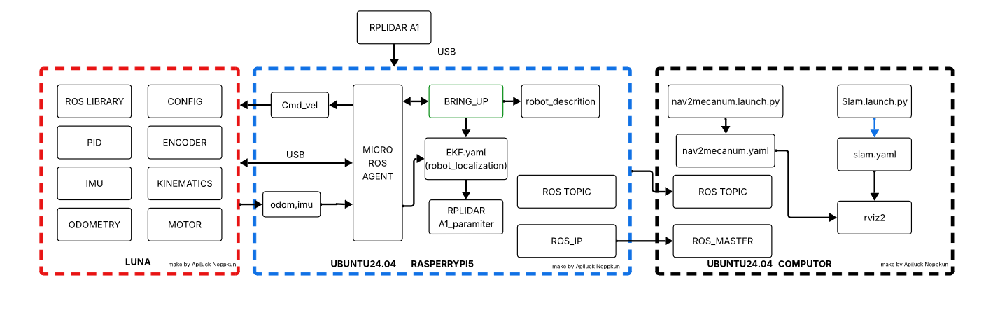
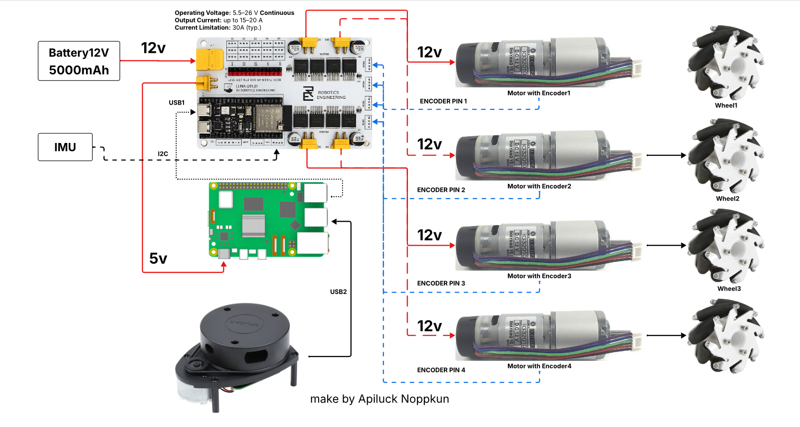
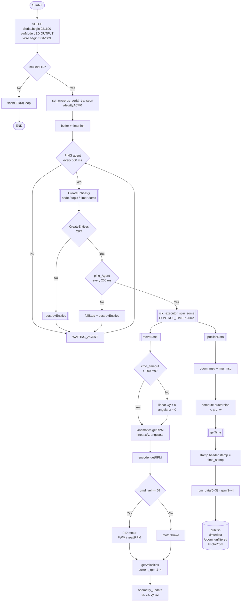

# LUNA Hardware Firmware

Firmware สำหรับ LUNA Mecanum Robot รันบน ESP32-S3 ใช้ micro-ROS ในการสื่อสารกับ ROS 2


### System Overview



---

## โครงสร้างโปรเจกต์

```
LUNA_BOT/
├── config/
│   └── luna_robot.h          # ค่า config หลักของหุ่นยนต์ (pin, PID, wheel)
├── main/
│   ├── platformio.ini        # config สำหรับ firmware หลัก
│   ├── src/
│   │   └── firmware.ino      # firmware หลัก (micro-ROS publisher/subscriber)
│   └── lib/
│       ├── encoder/          # อ่านค่า encoder
│       ├── imu/              # driver MPU6050
│       ├── kinematics/       # คำนวณ mecanum kinematics
│       ├── motor/            # driver มอเตอร์ (LUNA_MOTOR_DRIVE)
│       ├── odometry/         # คำนวณ odometry
│       └── pid/              # PID controller

---


## 3. Clone โปรเจกต์

```bash
git clone https://github.com/banh0001/luna_mecanum_robot_hardware.git
cd luna_mecanum_robot_hardware
```

---

## 1. ตั้งค่าหุ่นยนต์ (`config/luna_robot.h`)

ไฟล์นี้คือหัวใจของ config ทั้งหมด แก้ค่าให้ตรงกับฮาร์ดแวร์ก่อนอัพโหลด

**การเชื่อมต่อฮาร์ดแวร์ทั้งหมด:**



**บอร์ด LUNA:**


**มุมมองด้านข้าง:**


```cpp
// Hardware ที่ใช้
#define LUNA_MOTOR_DRIVER       // LUNA_DRIVER
#define IMU_MPU6050             // IMU MPU6050
#define LUNA_BASE MECANUM       // ประเภทฐานล้อ

// I2C pins
#define SDA_PIN 2
#define SCL_PIN 1

// PID gains สำหรับแต่ละมอเตอร์
#define K_P1 0.01
#define K_I1 1.0
#define K_D1 0

// ข้อมูลล้อและมอเตอร์
#define MOTOR_MAX_RPM           60      // RPM สูงสุดของมอเตอร์
#define WHEEL_DIAMETER          0.065   // เส้นผ่านศูนย์กลางล้อ (เมตร)
#define LR_WHEELS_DISTANCE      0.1975  // ระยะห่างระหว่างล้อซ้าย-ขวา (เมตร)

// Encoder counts per revolution (วัดจริงด้วยคำสั่ง sample)
#define COUNTS_PER_REV1 2250
#define COUNTS_PER_REV2 2102
#define COUNTS_PER_REV3 2276
#define COUNTS_PER_REV4 2139
```

**การจัดวางมอเตอร์:**
```
        FRONT
  MOTOR1    MOTOR2
  MOTOR3    MOTOR4
        BACK
```


---

## 5. Firmware หลัก (`main/`)

Firmware สำหรับใช้งานจริงกับ ROS 2 ผ่าน micro-ROS

### Firmware Flowchart




---

## 2. แก้ปัญหาที่พบบ่อย

| ปัญหา | สาเหตุ | แนวทางแก้ |
|---|---|---|
| Upload ไม่ได้ — `Permission denied /dev/ttyACM0` | ยังไม่มีสิทธิ์ USB | รัน `sudo usermod -aG dialout $USER` แล้ว reboot |
| Upload ไม่ได้ — port ไม่เจอ | ยังไม่ได้กด Boot button | กดค้าง **BOOT** บน ESP32-S3 ตอนกด Upload |
| `imu` command พิมพ์ ERROR | สาย I2C ผิด หรือ address ผิด | ตรวจ SDA/SCL pin ใน `luna_robot.h` และตรวจสายต่อ |
| micro-ROS Agent ต่อไม่ได้ | baud rate ไม่ตรง | ตรวจ `monitor_speed` ใน `main/platformio.ini` ต้องเป็น 921600 |
| Build error `#include errors` | library ยังไม่ได้ดาวน์โหลด | รัน `pio pkg install` หรือ Build ครั้งแรกรอสักครู่ |
| LED ไม่กะพริบหลัง upload | micro-ROS Agent ยังไม่ได้รัน | รัน agent บน PC ก่อน ESP32 จะเชื่อมต่อและ LED จะกะพริบ |
